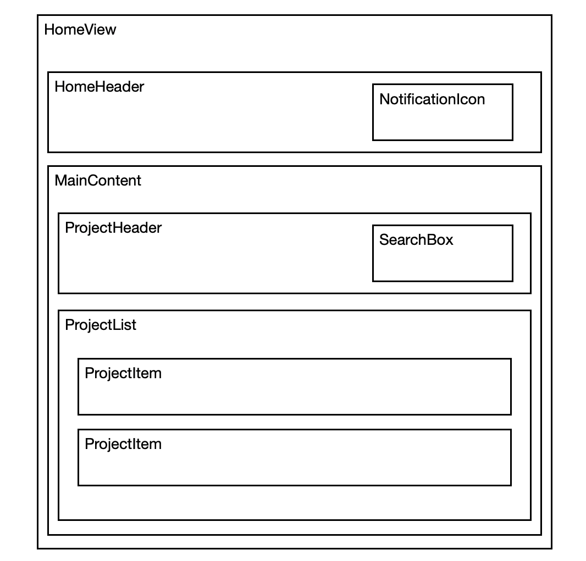

# Dashmote Software Engineer Case Client Application

Author: Zhichen Wen

This web application is deployed to Vercel.

URL: [https://dashmote-zcw.vercel.app/](https://dashmote-zcw.vercel.app/)

You can also clone this repo and run it in your own computer:

```bash
# install all dependencies
npm install
# run this web app locally
npm run dev
# build this web app
npm run build
```

# Documentation

This web app only has one page: the home page. There is one main Vue component file (HomeView.vue) for the home page where many subcomponents are included.

## Home page structure



## Important Files

### Components

| Name        | Description |
| ----------- | ----------- |
| /src/views/HomeView.vue | The main Vue component for the home page. Subcomponents for the home page are included in this file. |
| /src/components/Home/HomeHeader.vue | The component for the header of the home page |
| /src/components/Home/NotificationIcon.vue | The notification icon component used in the HomeHeader componenet |
| /src/components/Home/MainContent.vue | The component for the main content of the home page |
| /src/components/Home/ProjectHeader.vue | The component for the header of the MainContent componenet |
| /src/components/Home/SearchBox.vue | The search input box component used in the ProjectHeader component |
| /src/components/Home/ProjectList.vue | The subcomponent of the MainContent componenet showing the list of projects |
| /src/components/Home/ProjectItem.vue | The individual project component used in the ProjectList component |

### CSS

| Name        | Description |
| ----------- | ----------- |
| /src/assets/reset.css | A CSS stylesheet that resets the default values of many HTML elements |
| /src/assets/common.css | A CSS stylesheet that stores the common CSS styles used in Home components |

### Tests

| Name        | Description |
| ----------- | ----------- |
| /tests/HomeView.test.ts | Defines the tests for the HomeView component  |
| /tests/useProjects.test.ts | Defines the tests for the useProjects composition function |

### Other

| Name        | Description |
| ----------- | ----------- |
| /public/avatar.png | The avatar image that is used in this project       |
| /src/App.vue | The root component of this Vue app where HomeView.vue is inclueded |
| /src/main.ts | The Typescript file that initializes the root component |
| /use/projects.ts | Defines the projects data and data management functions  |
| /src/models/types.ts | Stores the custom Typescript types used in many components |